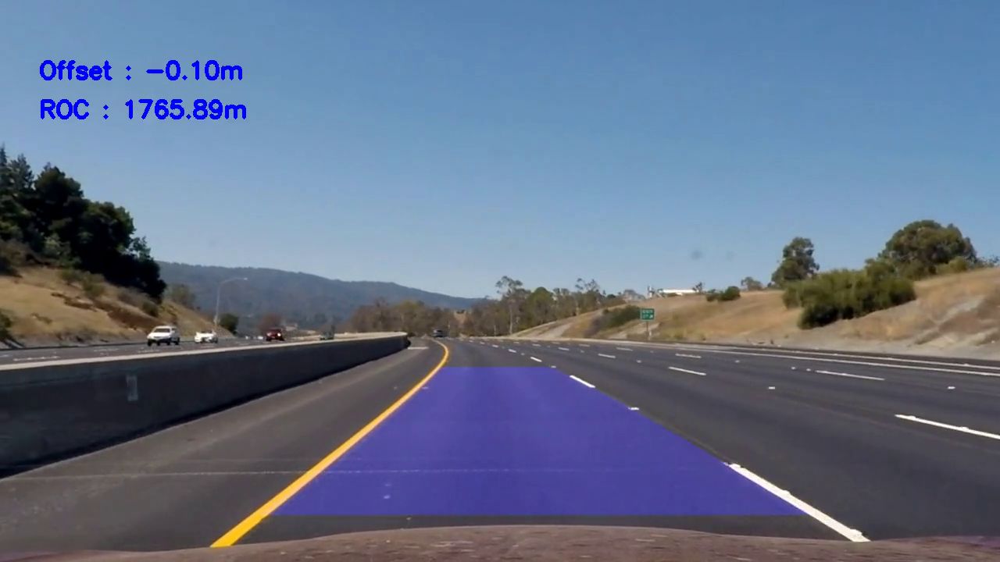

## Advanced Lane Finding

### Goal of the project:
To create a software pipeline to detect lane lines in images and videos and draw them back on image or video

### Requirements
1. CarND starter kit
2. Conda
3. OpenCv
4. Numpy

### Code
1. The code for this project is written in the IPython notebook [project.ipynb](./project.ipynb)

### Output images and videos
The output images are in the folder  `output_images`

[Link to the proccessed video](https://drive.google.com/open?id=0BwiJ5381w9ktTHg0VTk1M1lQdVU)

### Writeup
[Write up can be found here](./writeup.md)
