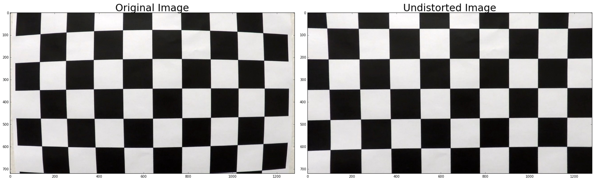
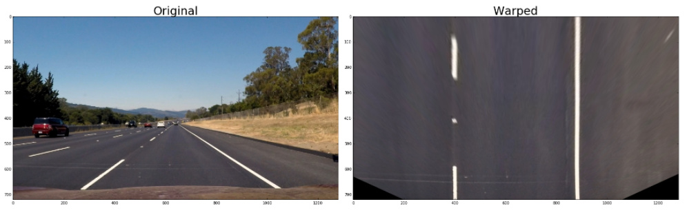
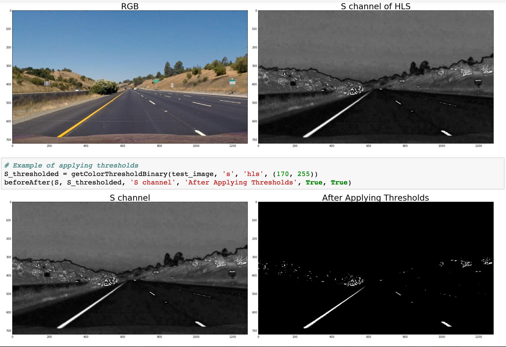
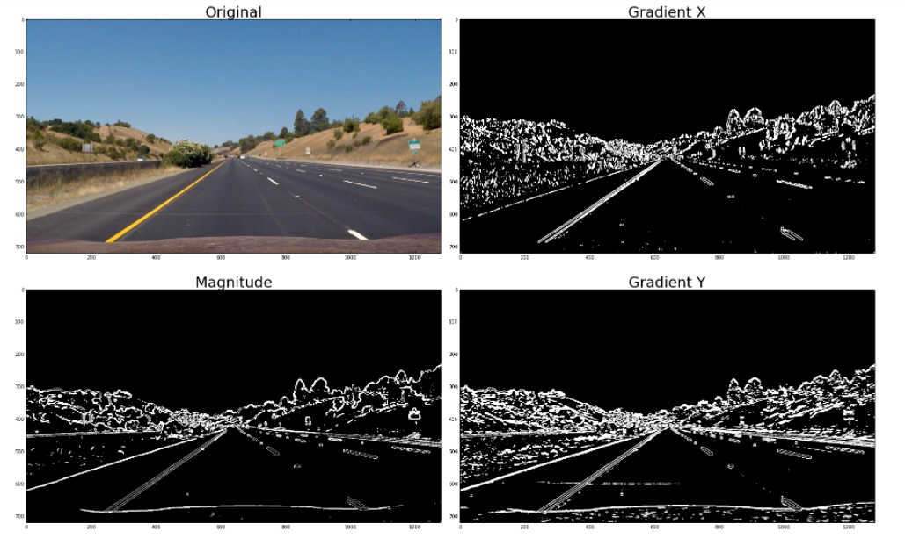
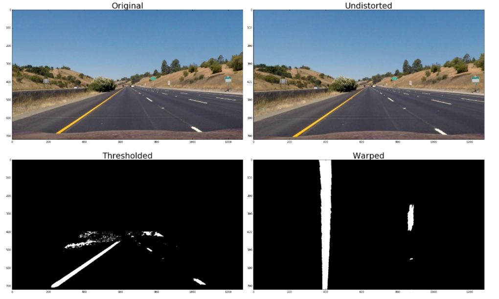
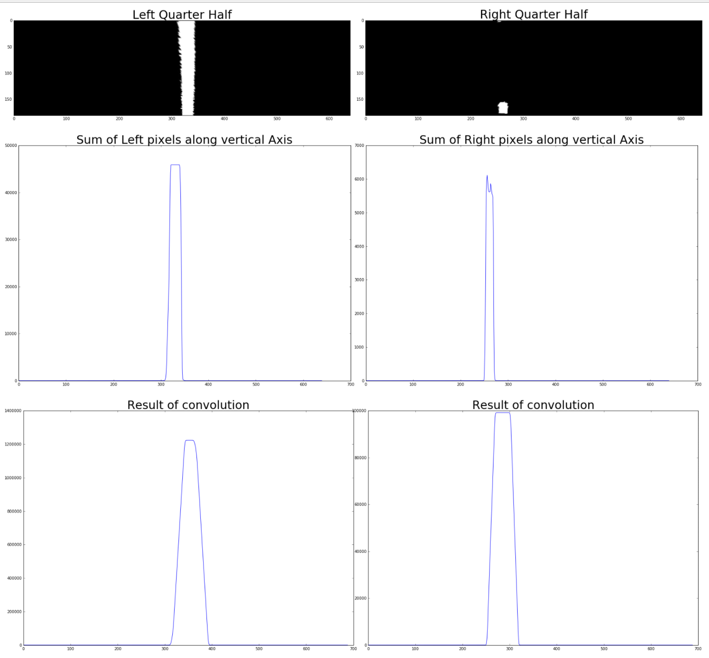
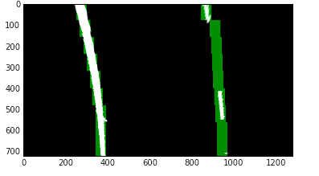
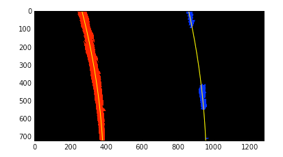
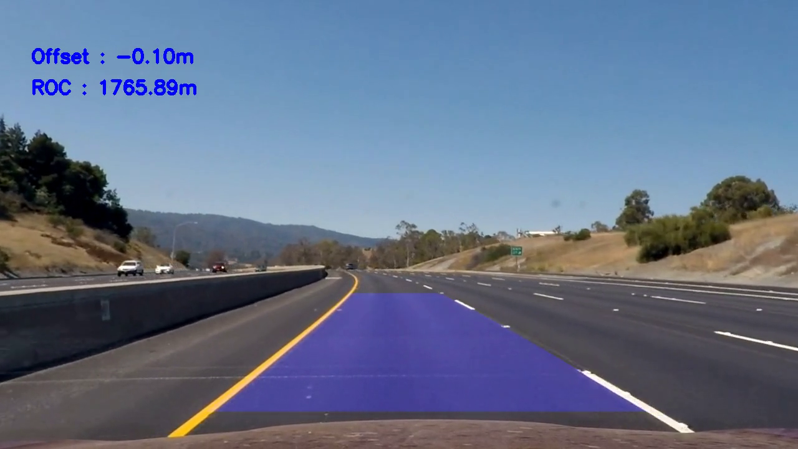
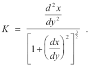

thresholds
---
# **Advanced Lane Detection**

---
### Pipeline to Detect Lane boundaries on the road

## Goal :

The goal of this project is to dynamically detect the lane boundaries drawn on the road from individual frames  of the video and draw the detected lane lines on the original frames

## Steps :

   1. Calibrate the camera to compute camera matrix and distortion coefficients.
   2. Undistort the images using the camera matrix and distortion coefficients calculated in step 1.
   3. Apply color and gradient thresholds to detect lane line pixels.
   4. Warp the image by changing perspective to a bird's-eye view of the road so that the lane lines appear rougly   parallel.
   5. Apply a sliding window search to the warped binary image to get the indices of the lane pixels.
   6. Fit a polynomial to each of left and right lane pixels found in previous steps.
   7. Draw the Detected lanes back to each individual frame of the video.

## **Calibrating the camera**
---
The images taken from a camera can have radial distortion caused by the bending of light around the edges of the camera lens. Tangential distortion can be induced if the lens is not properly aligned with the image sensor in the camera. The camera is calibrated by using the images of a 9x6 chessboard. The calculated camera matrix and distortion coefficients are saved in a pickle file for later use. To calculate the distortion coefficients and camera matrices the mapping of points in the image to image plane is calculated. This is done with the help of images of chessboard as the mapping is easy to calculate with the help of OpenCv `findChessBoardCorners()` function and we can easily calculate the coordinates of chessboard corners in the 2d image plane. Multiple images of chessboard taken from different different angles are used to accomplish this task.

**Example of correcting for distoryion**

As can be seen above in the undistorted image the lines appear curved while after correcting for distortion they appear straight.

**Location in code**
   - The code for calculating the distortion coefficients and camera matrix can be found in functions `getCalibrationPoints()` and `saveDistortionPickle()` functions
   - The code for undistorting an image can be found in function `undistort()`

## Changing the perspective
The car camera is mounted on the hood of the car. When viewing road from that angle the lane lines appear to converge towards each other when in fact they are roughly parallel. To correct this we change the perspective such that we get a birds eye view of the lane lines from where they appear parallel to each other. To accomplish this four source points are chosen from the undistorted image and a transform matrix to map them to four points in the transformed image is calculated. An inverse mapping matrix is also calculated so that the warped image can be unwarped to get the final  result.
The chosen four source points are

| Source  | Destination |
|:-------:|:------------|
| 300,660 |   400,720   |
| 1016,660|   880,720   |
| 720,470 |   880, 0    |   
| 567,470 |   400, 0    |

**Examples of perspective transform**

---

**Location in code**

- `warp()` and `unwarp` functions in the cells titled Perspective Change

## Color Thresholding
The lane line pixels are either of yellow or white color. To identify them we use OpenCV's inRange function. The S channel of HLS color space does not get effected by change in lighting and shadows. To identify white line pixels from just color thresholding we take all channels of RGB color space and the pixel values greater then a threshold are only evaluated. To compute the final result, the color thresholding is mixed with gradient thresholding described below

**Example of color thresholding**

**Location in code**

  - `getColorThresholdBinary()` function

## Gradient Thresholding

In addition to  thresholding the color channels another way to detect the lane lines is by calculating gradient to detect edges in an image. With the help Sobel operator it is possible to calculate the gradient in 'x' or 'y' directions. After calculating gradient only edges above a particular value of gradient are chosen. Gradients are calculated for individual color channels in the same was done in color thresholding

**The gradient can be calculated in the following ways**
    1. By taking gradient in particular 'x' or 'y' direction only
    2. By taking the magnitude of gradient from the gradients calculated in both 'x' and 'y' directions
    3. By calculating the directions of edges from the gradients calculated in both 'x' and 'y' directions
**Final output is calculated by choosing a combination of above three methods**

**Example of applying gradient thresholds**

**Location in code**

  - `gradientThreshold()` function

## Preprocessing done to image before searching for lines

The input image is expected to be in BGR color space. The input image is color and gradient thresholded and the binary images obtained from applying these thresholds are combined by bitwise and and or operations. The result image is warped and the pixels near the left and right edges of the image are set to 0 for better lane detection. The code to do this is written in preprocess and threshold functions.

---

**Location in code**

- `preprocess()` and `threshold()` functions

## Searching for a polynomial fit with sliding windows

After the binary warped image with lane pixels is obtained a sliding window search is done on it to identify left and right lane pixels. First the sum of bottom half of the image is taken and then a convolution is done with the help of `numpy's convolve` function. This maximizes the effect of lane pixels. The starting positions of our search for both left and right pixels are calculated as the peak of the convolve signals on both left and right halves of the image.
Once we have the right and left starting points of the lane lines, the image is sliced up into 9 vertical slices of height 80 pixels each. In the next slice the search  for  lane pixels is restricted around the previous found position of lane pixels. If no pixels are found then the window is only moved as much as it moved in the previous slice. This stops the window from moving to far away points. After the lane pixels are identified in the a second degree polynomial is fitted for both left and right lines. The polygon enclosed by the lines is drawn back to the original undistorted image

**Example of identifying lane pixels by taking sum**

**Example of the sliding window search**

**Example of lane lines drawn on binary image**

**Final unwarped image with radius of curvature and offset calculated**

** Location in code **

- `findLines()` function for finding fits. Keep debug = True if you want to visualize results
- `drawOnImage()` function to draw back on the original image

## Calculating the radius of curvature and offset
The radius of curvature for a polynomial y = f(x) can be calculated by using the following formula.

In the code the polynomial is fitted for x = f(y). The radius for curvature can be easily calculated for polynomial
x = Ay^2 + By + C  as r = (1+(2Ay + B)^2)^(1.5) / (|2A|). The values obtained here are in pixels. To calculate the values in meters, the polynomial is fitted for y values where 1 pixel of y = 30/720 meters and 1 pixel of x is 3.7/700 meters. This gives us the radius of curvature in meters.
To find the offset of the car from the center of the lane, the camera is assumed to be mounted on the midpoint of car. The offset is the difference between the midpoint of the base x values of left and right lanes and the midpoint of the image. Offset = midpoint - (l_base + x_base)/2. All the x values in this calculation are taken from the polynomial fitted in meter units.

**Location in code**

- `measureCurvatureAndOffset()` function.

## Tracking lines in a video
In the video there are 25 frames per second and there isn't much difference between two consecutive frames. Once lane line is fitted in one frame, the search in the next frame is restricted to 100 pixels on left and right of the previous fitted polynomial. If there are a lot of consecutive frames where the lines found were unusable, then the search for lines is started from scratch again. If there are only a few  misses, then lines found in previous frame can be used. The images received from video are in RGB color space. They are first undistorted and then  converted to BGR color space. The `drawOnImage()` functions uses undistorted RGB image to draw the detected lane lines on.

## Problems

1. In the lane lines where the number of lane pixels is not high can result in wobbly line
2. The color and gradient thresholds don't work when the image is too bright. A threshold which dynamically changes in extra light or extra dark conditions can be used.
3. If there are prominent yellow and white markings on the road it can produce false result.
4. The pipeline assumes the car is roughly in the middle of lane and searches on right half and left half of the image for left and right lines respectively. It will fail if the car offset of the car is enough to have lane lines start on the same half of the image.
5. If the road is too curvy, a higher order polynomial will be needed to be fitted.

## References
1. A lot of functions are copied from Udacity classroom
2. Stack Overflow
3. OpenCv and numpy documentation.
